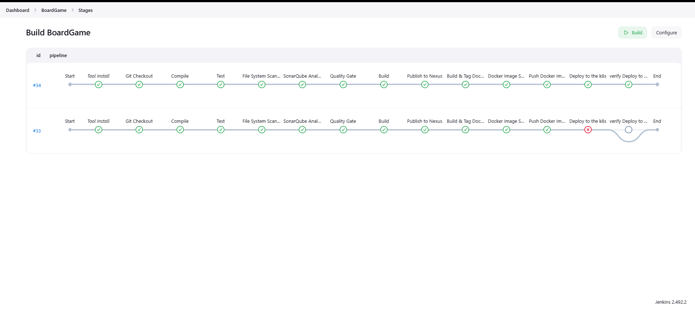
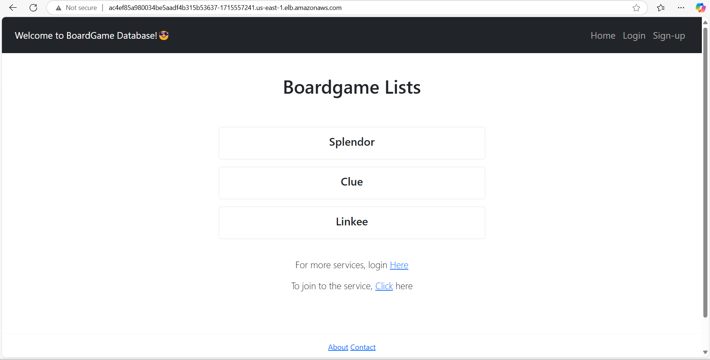

# boardgame-corp-pipeline


# Terraform AWS EKS Setup

This Terraform configuration provisions an Amazon Elastic Kubernetes Service (EKS) cluster with the necessary networking components.

## Prerequisites

Ensure you have the following installed:
- [Terraform](https://developer.hashicorp.com/terraform/downloads)
- [AWS CLI](https://aws.amazon.com/cli/)
- AWS account with appropriate permissions
- SSH key pair (modify `ssh_key_name` variable if needed)

## Resources Created

1. **VPC (Virtual Private Cloud)**
    - A VPC named `maberathna-vpc` with CIDR `10.0.0.0/16`.
    - Two public subnets (`maberathna-subnet-0` and `maberathna-subnet-1`).
    - An Internet Gateway (`maberathna-igw`) for external connectivity.
    - A Route Table (`maberathna-route-table`) with a default route to the internet.

2. **Security Groups**
    - `maberathna-cluster-sg`: Allows all outbound traffic.
    - `maberathna-node-sg`: Allows all inbound and outbound traffic.

3. **IAM Roles**
    - `maberathna-cluster-role` with `AmazonEKSClusterPolicy`.
    - `maberathna-node-group-role` with policies for worker nodes.

4. **EKS Cluster and Node Group**
    - `maberathna-cluster`: A managed EKS cluster.
    - `maberathna-node-group`: A node group with three `t2.medium` instances.
    - SSH access enabled for remote management.

## Terraform Configuration

```hcl
esource "aws_route_table_association" "a" {
  count          = 2
  subnet_id      = aws_subnet.maberathna_subnet[count.index].id
  route_table_id = aws_route_table.maberathna_route_table.id
}

resource "aws_security_group" "maberathna_cluster_sg" {
  vpc_id = aws_vpc.maberathna_vpc.id

  egress {
    from_port   = 0
    to_port     = 0
    protocol    = "-1"
    cidr_blocks = ["0.0.0.0/0"]
  }

  tags = {
    Name = "maberathna-cluster-sg"
  }
}

resource "aws_security_group" "maberathna_node_sg" {
  vpc_id = aws_vpc.maberathna_vpc.id

  ingress {
    from_port   = 0
    to_port     = 0
    protocol    = "-1"
    cidr_blocks = ["0.0.0.0/0"]
  }

  egress {
    from_port   = 0
    to_port     = 0
    protocol    = "-1"
    cidr_blocks = ["0.0.0.0/0"]
  }

  tags = {
    Name = "maberathna-node-sg"
  }
}

resource "aws_eks_cluster" "maberathna" {
  name     = "maberathna-cluster"
  role_arn = aws_iam_role.maberathna_cluster_role.arn

  vpc_config {
    subnet_ids         = aws_subnet.maberathna_subnet[*].id
    security_group_ids = [aws_security_group.maberathna_cluster_sg.id]
  }
}

resource "aws_eks_node_group" "maberathna" {
  cluster_name    = aws_eks_cluster.maberathna.name
  node_group_name = "maberathna-node-group"
  node_role_arn   = aws_iam_role.maberathna_node_group_role.arn
  subnet_ids      = aws_subnet.maberathna_subnet[*].id

  scaling_config {
    desired_size = 3
    max_size     = 3
    min_size     = 3
  }

  instance_types = ["t2.medium"]

  remote_access {
    ec2_ssh_key               = var.ssh_key_name
    source_security_group_ids = [aws_security_group.maberathna_node_sg.id]
  }
}

resource "aws_iam_role" "maberathna_cluster_role" {
  name = "maberathna-cluster-role"

  assume_role_policy = <<EOF
{
  "Version": "2012-10-17",
  "Statement": [
    {
      "Effect": "Allow",
      "Principal": {
        "Service": "eks.amazonaws.com"
      },
      "Action": "sts:AssumeRole"
    }
  ]
}
EOF
}

resource "aws_iam_role_policy_attachment" "maberathna_cluster_role_policy" {
  role       = aws_iam_role.maberathna_cluster_role.name
  policy_arn = "arn:aws:iam::aws:policy/AmazonEKSClusterPolicy"
}

resource "aws_iam_role" "maberathna_node_group_role" {
  name = "maberathna-node-group-role"

  assume_role_policy = <<EOF
{
  "Version": "2012-10-17",
  "Statement": [
    {
      "Effect": "Allow",
      "Principal": {
        "Service": "ec2.amazonaws.com"
      },
      "Action": "sts:AssumeRole"
    }
  ]
}
EOF
}

resource "aws_iam_role_policy_attachment" "maberathna_node_group_role_policy" {
  role       = aws_iam_role.maberathna_node_group_role.name
  policy_arn = "arn:aws:iam::aws:policy/AmazonEKSWorkerNodePolicy"
}

resource "aws_iam_role_policy_attachment" "maberathna_node_group_cni_policy" {
  role       = aws_iam_role.maberathna_node_group_role.name
  policy_arn = "arn:aws:iam::aws:policy/AmazonEKS_CNI_Policy"
}

resource "aws_iam_role_policy_attachment" "maberathna_node_group_registry_policy" {
  role       = aws_iam_role.maberathna_node_group_role.name
  policy_arn = "arn:aws:iam::aws:policy/AmazonEC2ContainerRegistryReadOnly"
}

```

```hcl
output "cluster_id" {
  value = aws_eks_cluster.maberathna.id
}

output "node_group_id" {
  value = aws_eks_node_group.maberathna.id
}

output "vpc_id" {
  value = aws_vpc.maberathna_vpc.id
}

output "subnet_ids" {
  value = aws_subnet.maberathna_subnet[*].id
}

variable "ssh_key_name" {
  description = "The name of the SSH key pair to use for instances"
  type        = string
  default     = "newaws"
}
```

## Usage

### Initialize Terraform
```sh
terraform init
```

### Plan the Deployment
```sh
terraform plan
```

### Apply the Configuration
```sh
terraform apply -auto-approve
```

### Destroy the Infrastructure
```sh
terraform destroy -auto-approve
```

## Outputs
- `cluster_id`: The ID of the created EKS cluster.
- `node_group_id`: The ID of the created node group.
- `vpc_id`: The ID of the VPC.
- `subnet_ids`: List of subnet IDs.

## Variables
| Variable | Description | Default |
|----------|-------------|---------|
| `ssh_key_name` | The name of the SSH key pair for instances | `newaws` |

## Notes
- Ensure your AWS credentials are properly configured using `aws configure`.
- Modify `availability_zone` in the subnet resource if needed.
- Review security group rules before applying in production.

# Jenkins, Docker, Nexus, SonarQube, and CI/CD Setup

## Prerequisites
Ensure you have a system running Ubuntu with sudo privileges.

---

## 1. Install Jenkins

Save the following script as `install_jenkins.sh`, make it executable, and run it.

```bash
#!/bin/bash
# Install OpenJDK 17 JRE Headless
sudo apt install openjdk-17-jre-headless -y

# Download Jenkins GPG key
sudo wget -O /usr/share/keyrings/jenkins-keyring.asc \
https://pkg.jenkins.io/debian-stable/jenkins.io-2023.key

# Add Jenkins repository
echo deb [signed-by=/usr/share/keyrings/jenkins-keyring.asc] \
https://pkg.jenkins.io/debian-stable binary/ | sudo tee \
/etc/apt/sources.list.d/jenkins.list > /dev/null

# Update repositories and install Jenkins
sudo apt-get update
sudo apt-get install jenkins -y
```

Run the script:
```bash
chmod +x install_jenkins.sh
./install_jenkins.sh
```

Start and enable Jenkins:
```bash
sudo systemctl start jenkins
sudo systemctl enable jenkins
```

---

## 2. Install Docker

Save the following script as `install_docker.sh`, make it executable, and run it.

```bash
#!/bin/bash
# Update repositories
sudo apt-get update

# Install necessary dependencies
sudo apt-get install -y ca-certificates curl

# Create directory for Docker GPG key
sudo install -m 0755 -d /etc/apt/keyrings

# Download Docker's GPG key
sudo curl -fsSL https://download.docker.com/linux/ubuntu/gpg -o /etc/apt/keyrings/docker.asc

# Ensure proper permissions
sudo chmod a+r /etc/apt/keyrings/docker.asc

# Add Docker repository
echo "deb [arch=$(dpkg --print-architecture) signed-by=/etc/apt/keyrings/docker.asc] https://download.docker.com/linux/ubuntu \
$(. /etc/os-release && echo "$VERSION_CODENAME") stable" | \
sudo tee /etc/apt/sources.list.d/docker.list > /dev/null

# Update and install Docker
sudo apt-get update
sudo apt-get install -y docker-ce docker-ce-cli containerd.io docker-buildx-plugin docker-compose-plugin
```

Run the script:
```bash
chmod +x install_docker.sh
./install_docker.sh
```

---

## 3. Set Up Nexus

Run the following command to create a Nexus container:
```bash
docker run -d --name nexus -p 8081:8081 sonatype/nexus3:latest
```

Retrieve the Nexus admin password:
```bash
docker ps
docker exec -it <container_ID> /bin/bash
cd sonatype-work/nexus3
cat admin.password
exit
```

Access Nexus at `http://<your-IP>:8081`.

---

## 4. Set Up SonarQube

Run the following command to create a SonarQube container:
```bash
docker run -d --name sonar -p 9000:9000 sonarqube:lts-community
```

Access SonarQube at `http://<your-IP>:9000`.

---

## 5. Set Up Private Git Repository

1. Create a private repository on GitHub, GitLab, or Bitbucket.
2. Generate a Personal Access Token.
3. Clone the repository:
   ```bash
   git clone <repository_URL>
   ```
4. Add files, stage, and commit:
   ```bash
   git add .
   git commit -m "Initial commit"
   git push
   ```
5. Use your personal access token for authentication when prompted.

---

## 6. Install Jenkins Plugins for CI/CD

Install the following plugins in Jenkins:

1. **Eclipse Temurin Installer**
2. **Pipeline Maven Integration**
3. **Config File Provider**
4. **SonarQube Scanner**
5. **Kubernetes CLI**
6. **Kubernetes**
7. **Docker**
8. **Docker Pipeline Step**

### Steps to Install Plugins
- Go to **Jenkins Dashboard** → **Manage Jenkins** → **Manage Plugins** → **Available tab**
- Search for each plugin, select it, and click **Install without restart**

---

## Jenkins Pipeline Script

```groovy
pipeline {
    agent any
    
    tools {
        jdk 'jdk17'
        maven 'maven'
    }
    
    environment {
        SCANNER_HOME = tool 'sonar-scanner'
    }

    stages {
        stage('Git Checkout') {
            steps {
                git branch: 'main', credentialsId: 'git-cred', url: 'https://github.com/maberathna/boardgame-corp-pipeline.git'
            }
        }
        
        stage('Compile') {
            steps {
                sh "mvn compile"
            }
        }
        
        stage('Test') {
            steps {
                sh "mvn test"
            }
        }
        
        stage('File System Scanner') {
            steps {
                sh 'trivy fs --format table -o trivy-fs-report.html .'
            }
        }
        
        stage('SonarQube Analysis') {
            steps {
                withSonarQubeEnv('sonar') {
                    sh '''$SCANNER_HOME/bin/sonar-scanner \
                           -Dsonar.projectName=BoardGame \
                           -Dsonar.projectKey=BoardGame \
                           -Dsonar.java.binaries=.'''
                }
            }
        }
        
        stage('Quality Gate') {
            steps {
                script {
                    waitForQualityGate abortPipeline: false, credentialsId: 'sonar-token' 
                }
            }
        }
        
        stage('Build') {
            steps {
               sh "mvn package"
            }
        }
        
        
        stage('Publish to Nexus') {
            steps {
                withMaven(globalMavenSettingsConfig: 'global-settings', jdk: 'jdk17', maven: 'maven', mavenSettingsConfig: '', traceability: true) {
                    sh "mvn deploy"
                }
            }
        }
        
        stage('Build & Tag Docker Image') {
            steps {
                script {
                    withDockerRegistry(credentialsId: 'docker-cred', toolName: 'docker') {
                        sh "docker build -t maberathna/boardgame-app:latest ."
                    }
                }
            }
        }
        
        stage('Docker Image Scanner') {
            steps {
                sh 'trivy image --format table -o trivy-image-report.html maberathna/boardgame:latest'
            }
        }
        
        stage('Push Docker Image') {
            steps {
                script {
                    withDockerRegistry(credentialsId: 'docker-cred', toolName: 'docker') {
                        sh "docker push maberathna/boardgame-app:latest"
                    }
                }
            }
        }
        
        stage('Deploy to the k8s') {
            steps {
                withKubeConfig(caCertificate: '', clusterName: 'maberathna-cluster', contextName: '', credentialsId: 'k8-cred', namespace: 'webapps', restrictKubeConfigAccess: false, serverUrl: 'https://64F3C00D242397024A7FFC4BA5E17651.gr7.us-east-1.eks.amazonaws.com') {
                    sh "kubectl apply -f deployment-service.yaml"
                    sleep 20
                }
            }
        }
        
         stage('Verify Deploy to the k8s') {
            steps {
                withKubeConfig(caCertificate: '', clusterName: 'maberathna-cluster', contextName: '', credentialsId: 'k8-cred', namespace: 'webapps', restrictKubeConfigAccess: false, serverUrl: 'https://64F3C00D242397024A7FFC4BA5E17651.gr7.us-east-1.eks.amazonaws.com') {
                    sh "kubectl get pods"
                    sh "kubectl get svc"
                }
            }
        }
    }
    
    post {
        always {
            script {
                def jobName = env.JOB_NAME
                def buildNumber = env.BUILD_NUMBER
                def pipelineStatus = currentBuild.result ?: 'UNKNOWN'
                def bannerColor = pipelineStatus.toUpperCase() == 'SUCCESS' ? 'green' : 'red'

                def body = """
                    <html>
                    <body>
                    <div style="border: 4px solid ${bannerColor}; padding: 10px;">
                    <h2>${jobName} - Build ${buildNumber}</h2>
                    <div style="background-color: ${bannerColor}; padding: 10px;">
                    <h3 style="color: white;">Pipeline Status: ${pipelineStatus.toUpperCase()}</h3>
                    </div>
                    <p>Check the <a href="${BUILD_URL}">console output</a>.</p>
                    </div>
                    </body>
                    </html>
                """

                emailext (
                    subject: "${jobName} - Build ${buildNumber} - ${pipelineStatus.toUpperCase()}",
                    body: body,
                    to: 'chirantharavishka@gmail.com','sandaruwanctk@gmail.com',
                    from: 'jenkins@example.com',
                    replyTo: 'jenkins@example.com',
                    mimeType: 'text/html',
                    attachmentsPattern: 'trivy-image-report.html'
                )
            }
        }
    }
}
```

# Monitoring

### Links to download Prometheus, Node_Exporter & black Box exporter https://prometheus.io/download/
### Links to download Grafana https://grafana.com/grafana/download
### Other link from video https://github.com/prometheus/blackbox_exporter

### Update and Install Dependencies

```sh
sudo apt update
sudo apt install openjdk-17-jre-headless -y
sudo apt install maven -y
```

### Clone the Repository and Build the Application

```sh
git clone <repo_url>
cd devops-monitoring-hands-on/
mvn package
```

### Run the Application

```sh
cd target/
java -jar todo-app-1.0-SNAPSHOT.jar
```

### Install and Configure Node Exporter

```sh
wget https://github.com/prometheus/node_exporter/releases/download/v1.9.0/node_exporter-1.9.0.linux-amd64.tar.gz
tar -xvf node_exporter-1.9.0.linux-amd64.tar.gz
rm node_exporter-1.9.0.linux-amd64.tar.gz
mv node_exporter-1.9.0.linux-amd64/ node_exporter
cd node_exporter/
./node_exporter &
```

---

## 2. Setup Prometheus and Blackbox Exporter on EC2 t3.large Instance

### Update System

```sh
sudo apt update
```

### Install Prometheus

```sh
wget https://github.com/prometheus/prometheus/releases/download/v2.37.0/prometheus-2.37.0.linux-amd64.tar.gz
tar -xzf prometheus-2.37.0.linux-amd64.tar.gz
cd prometheus-2.37.0.linux-amd64/
./prometheus --config.file=prometheus.yml &
```

### Install Blackbox Exporter

```sh
wget https://github.com/prometheus/blackbox_exporter/releases/latest/download/blackbox_exporter-linux-amd64.tar.gz
tar -xzf blackbox_exporter-linux-amd64.tar.gz
cd blackbox_exporter-linux-amd64/
./blackbox_exporter &
```

---

## 3. Configure Prometheus for Monitoring

Edit the `prometheus.yml` file:

```yaml
scrape_configs:
  - job_name: "node_exporter"
    static_configs:
      - targets: ["EC2-t2-medium-IP:9100"]

  - job_name: "blackbox"
    metrics_path: /probe
    params:
      module:
        - http_2xx
    static_configs:
      - targets:
          - http://prometheus.io
          - https://prometheus.io
          - application url
    relabel_configs:
      - source_labels: [__address__]
        target_label: __param_target
      - source_labels: [__param_target]
        target_label: instance
      - target_label: __address__
        replacement: blackboc explorter url
```

Restart Prometheus after configuration:

```sh
sudo systemctl restart prometheus
```

---

## 4. Install Grafana

```sh
sudo apt-get install -y adduser libfontconfig1 musl

wget https://dl.grafana.com/enterprise/release/grafana-enterprise_11.5.2_amd64.deb

sudo dpkg -i grafana-enterprise_11.5.2_amd64.deb
```

Start Grafana service:

```sh
sudo systemctl start grafana-server
sudo systemctl enable grafana-server
```

|                                                            |                                                            |                                                            |                                                            |
|:----------------------------------------------------------:|:----------------------------------------------------------:|:----------------------------------------------------------:|:----------------------------------------------------------:|
|     |      |      |      |
|      |      |      |      |
|     |  |  | |
|  |  |  |  |
|  |                                                            |                                                            |                                                            |


